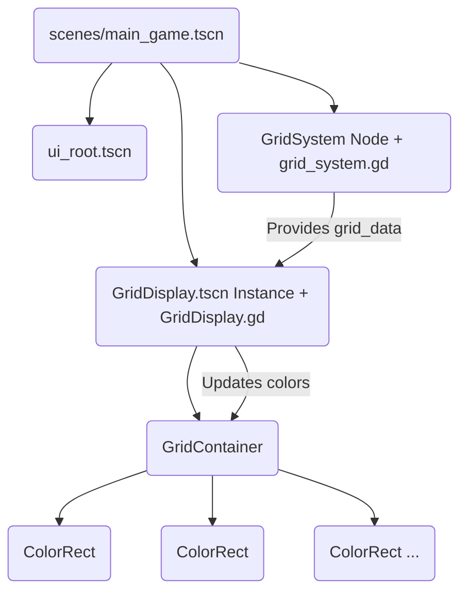

# Plan: Task 2 - Implement Grid System

## 1. Goal

Implement the core data structure for the 16x9 game grid and create a basic visual representation of it within the main game scene, as defined in `GTD.md` Task 2.

## 2. Proposed Implementation

### 2.1 Grid Data Structure (`grid_system.gd`)

- **Create Script:** A new script `scr/core/grid_system.gd` will be created.
- **Inner Class:** Define an inner class `CellData` within `grid_system.gd` to hold the state of each grid cell:

  ```gdscript
  class CellData:
      var color: Color = Color.TRANSPARENT # Current color of the cell
      var blend_count: int = 0           # How many times a color has been blended onto this cell
  ```

- **Data Storage:** Use a 2D Array `grid_data: Array[Array]` within `grid_system.gd` to store `CellData` instances for the 16x9 grid.
- **Initialization:** Implement an `initialize_grid()` function to create the 16x9 array and populate it with default `CellData` objects.
- **Node:** Attach this script to a new `Node` named `GridSystem` in the main game scene.

### 2.2 Basic Grid Display (`GridDisplay.tscn`)

- **Create Scene:** A new scene `scenes/grid/GridDisplay.tscn` will be created.
- **Root Node:** The root will be a `Control` node (or similar UI node).
- **Visual Representation:** Use a `GridContainer` node within `GridDisplay.tscn`. Set its `columns` property to 16.
- **Cell Nodes:** Programmatically add 144 (16x9) `ColorRect` nodes as children to the `GridContainer`. Each `ColorRect` will represent a cell. Store references to these `ColorRect` nodes, perhaps in another 2D array matching the grid structure.
- **Update Logic:** Add a script `GridDisplay.gd` to `GridDisplay.tscn`. This script will contain a function `update_display(grid_data: Array)` which takes the grid data (from `GridSystem`) and updates the `color` property of each corresponding `ColorRect` node.
- **Sizing:** Ensure the `GridContainer` and `ColorRect` nodes are configured to display correctly (e.g., set appropriate `custom_minimum_size` for `ColorRect`s).

### 2.3 Integration (`main_game.tscn`)

- **Add GridSystem Node:** Add a standard `Node` named `GridSystem` to `scenes/main_game.tscn` and attach the `scr/core/grid_system.gd` script to it.
- **Instantiate GridDisplay:** Instantiate the `scenes/grid/GridDisplay.tscn` scene within `scenes/main_game.tscn`.
- **Initial Update:** In the `_ready()` function of a script attached to `main_game.tscn` (or potentially the `GridSystem` node itself), call `initialize_grid()` on the `GridSystem` node, then pass the initial `grid_data` to the `update_display()` function of the `GridDisplay` instance.

### 2.4 Node Structure (Conceptual)



## 3. Next Steps

1. Review this plan.
2. Approve the plan or suggest modifications.
3. Once approved, I will request to switch to the appropriate mode (likely 'code' or 'game-designer') to implement these changes.
